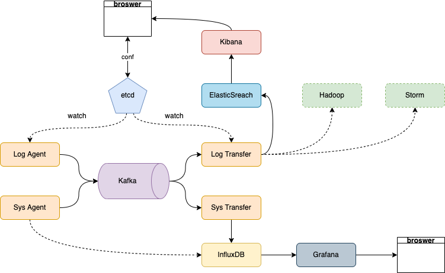

# 日志收集项目架构设计

## 项目背景
每个业务都有日志，当系统出现问题时，需要通过日志信息来定位和解决问题。当系统机器比较少时，登录到服务器上查看即可满足；当系统及其规模巨大，登录到机器上查看几乎不现实（分布式系统，一个系统部署在十几台机器上）
## 解决方案
把机器上的日志实时收集，统一存储到中心系统。再对这些日志建立索引，通过搜索即可快速找到对应的日志记录。通过提供一个界面友好的web页面实现日志展示与检索
## 业界解决方案-ELK

## ELK方案的问题
1.运维成本高，每增加一个日志收集项，都需要手动修改配置
2.监控缺失，无法准确获取logstash状态
3.无法做到定制化开发与维护

## 架构设计

## 主要组件介绍
LogAgent： 日志收集客户端，用来收集服务器上的日志。
Kafka：高吞吐量的分布式队列（Link开发，apache顶级开源项目）。
ElasticSearch：开源的搜索引擎，提供基于HTTP RESTful的web接口。
Kibana：开源的ES数据分析和可视化工具。
Hadoop：分布式计算框架，能够对大量数据进行分布式处理的平台。
Storm：一个免费且开源的分布式实时计算系统

## 学习到的技能
1. 服务端agent开发
2. 后段服务组件开发
3. Kafka和zookeeper的使用
4. ES和Kibana的使用
5. etcd的使用

## Kafka介绍
基础结构：producer -> cluster -> consumer
### 1. Kafka集群架构
· broker
· topic
· partition：leader和follower
· replication
### 2. Kafka发送数据的流程（6步）
1. 生产者从Kafka集群获取分区leader信息
2. 生产者将消息发送给leader
3. leader将消息存储在本地磁盘
4. follower从leader拉取消息
5. follower向leader回复ack
6. leader收到所有ack后向producer发送ack
### 3. Kafka选择分区的模式（3种）
1. 指定往哪个分区写
2. 给定key，根据key做hash，决定写哪个分区
3. 轮询方式
### 4.生产者往kafka发送数据的模式（3种）
1. 0：把数据发送给leader就结束
2. 1: 把数据发送给leader等待leader的ack
3. 2: 把数据发送给leader，follower拉去数据回复ack给leader，leader再回复ack
## ZooKeeper
zookeeper是一个分布式的，开放源码的分布式应用程序协调服务，时Google的Chubby一个开源的实现，他是集群的管理者，监视着集群中各个节点的状态根据节点提交的反馈进行下一步的合理操作。最终，将简单易用的接口和性能高效、功能稳定的系统提供给用户
## LogAgent的工作流程
1. 读日志-tailf第三方库
2. 往kafka写日志
## go_ini模块
读取配置文件，并且映射到结构体上

## etcd
etcd是使用Go语言开发的一个开源的，高可用的分布式key-value存储系统，可以用于配置共享和服务的注册和发现，类似的项目有zookeeper和consul。
### etcd的特点
1. 完全复制：集群中的每个节点都可以使用完整的存档
2. 高可用性：etcd可用于避免硬件的单点故障或者网络问题
3. 一致性：每次读取都会返回跨多主机的最新写入
4. 简单：包括一个定义良好、面向用户的API（gRPC）
5. 安全：实现了带有可选客户端证书身份验证的自动化TLS
6. 快速：每秒10000次写入的基准速度
7. 可靠：使用Raft算法实现了强一致，高可用的服务存储目录
### etcd应用场景
#### 服务发现
服务发现要解决的也是分布式系统中最常见的问题之一，即在同一个分布式集群汇总的进程或服务，要如何才能找到对方并建立连接。本质上来说，服务发现就是想要了解集群中是否有进程在监听udp或tcp端口，并且通过名字就可以查找和连接
#### 配置中心
将一些配置信息放到etcd上进行集中管理
这类场景的使用方式通常是这样的：应用在启动的时候主动从etcd获取一次配置信息，同时，在etcd节点上注册一个watcher并等待，以后每次配置有更新的时候，etcd都会实时通知订阅者，以此达到获取最新配置信息的目的
#### 分布式锁

### etcd集群
etcd作为一个高可用键值存储系统，天生就是为集群化而设计的。
#### 搭建集群

## LogTransfer
从Kafka中读取日志，发送到ES，并使用Kibana做可视化展示
## 系统监控
方案一：gopsutil做系统监控信息的采，写入influxDB，使用grafana做展示
方案二：prometheus做监控，采集性能指标数据，保存起来，使用grafana作战时
## ElasticSearch
### ES简介
ElasticSearch是一个基于Lucene构建的开源、分布式、RESTful的全文搜索引擎

## Kibana
